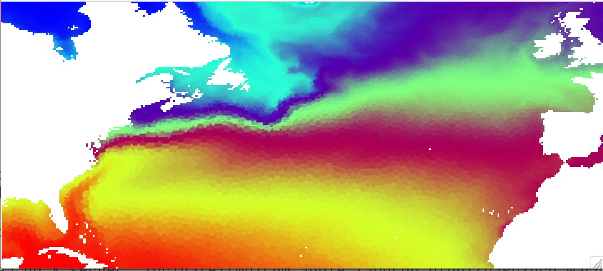
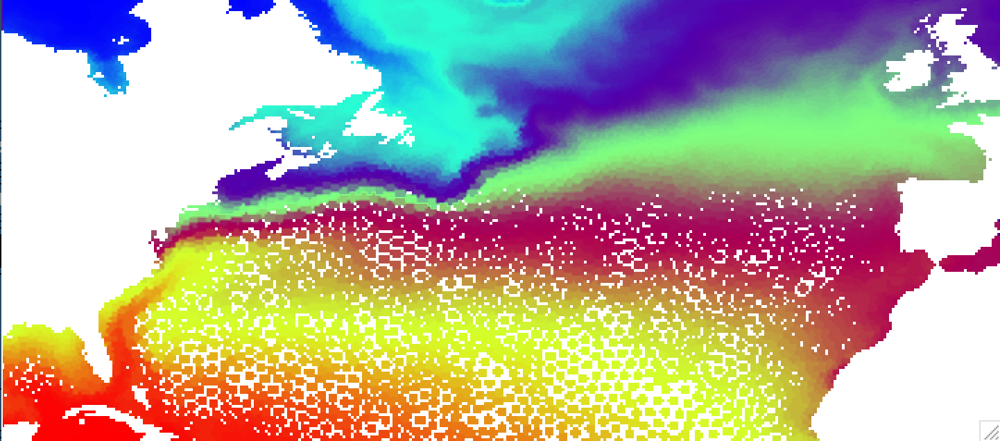

.. _pfinterp:

pfinterp
========

Interpolates scalar and vector data from FESOM mesh to regular lon/lat grid.

Basic usage
-----------

As a minimum you should provide path to the mesh, path to the file, path were the ouptut will be stored and variable name::

    pfinterp  /path/to/mesh/ /path/to/datafolder/ temp

by default `pfinterp` will search for the year 1948 and interpolate first time step from the depth 0 to 1 degree lon/lat regular grid.

In the following we just going to replace paths by shell variables::

    MESH=/path/to/mesh/
    DATA=/path/to/datafolder/

to make examples more consise. It is also a good practice to setup such variables for yourself, so the commands are shorter.

You can get help with list of all available options by executing::

    pfinterp --help

The resolution of the target grid is controlled by `-r` option, that accepts 2 arguments - number of longitudes and number of latitudes. For example to interpolate to the 1/4 degree grid for the box in the North Atlantic (defined by `-b` option), you should do the following::

    pfinterp $MESH $DATA temp -b -90 0 20 60 -r 360 160

If you do such interpolation for FESOM results on the COREII mesh and open the resulting file in ncview, it will look like this:

Example of a query with most common options::

    pfinterp $MESH $DATA temp -y 1950:1955 -d 0,100,500 -r 1440 720 -i 40000 --interp idist -k 5 -o /path/to/output.nc

This will result in interpolation of data from 6 years, for depths 0, 100 and 500 meters, with 1/4 degree resolution (1440x720 points), with radius of influence (characterisitc needed for nearest neighbor and inverse distance interpolations) of 40000 meters (40 km). The `--interp` sets `idist` (inverse distance) interpolation and with `-k` option you provide the number of neighboring points that will be used for interpolation. The `-o` sets the path to output `netCDF` file.

Below we look at some of the options in more detail.

Select time
-----------

You probably not always want to look at the default first timestep of the year 1948. There are several ways to select time intervals you would like to interpolate. First we can select different year (`-y` option)::

    pfinterp $MESH $DATA temp -y 1950

We also can select range of years::

    pfinterp $MESH $DATA temp -y 1950:1955

You will get one file with 6 fields (from 1950 to 1955 included). You can select specific years::

    pfinterp $MESH $DATA temp -y 1950,1955,1959

OK selecting the complete years is fine, but what if we need only some specific timesteps from the years we are selecting? Unfortunatelly for now you have to know how many timesteps you have selected with your year selection. To make it simplier here are couple of examples of year selection, time frequency of the data stored in each file and resulting number of timesteps:

==============     =========  =========
years              frequency  timesteps
--------------     ---------  ---------
1950                 yearly     1
1950:1959            yearly    10
1950:1959            monthly   120
1950,1952,1959       monthly   36
==============     =========  =========

To select one time step, you can just do::

    pfinterp $MESH $DATA temp -y 1950:1955 -t 5

this will select 5th timestep, but **THE COUNTING STARTS AT 0**, so for you files have data with monthly frequency, you will get interpolated field for **JUNE**.

You can select several timesteps (**no spaces between values!**)::

    pfinterp $MESH $DATA temp -y 1950:1955 -t 5,7,10

This particular case will return June, August ans November in case of monthly data.

You can select a slice of timesteps::

    pfinterp $MESH $DATA temp -y 1950:1955 -t 11:14

This, in case of monthly data, will select Dacember from the year 1950, and January, February from the year 1951. In contrast to years, **the last number** (in this case 14) **is not included**, similar to python slices.

Probably the most useful use of timestep selection, is when you have to exctract some month from the long line of monthly data. You can do it by providing slices with steps, like this::

    pfinterp $MESH $DATA temp -y 1950:1955 -t 8:72:12

This will return all timesteps starting from number 8 (September, remember we start to count from 0) untill the timestep 72 with step 12. So you will get all Septembers from years 1950 to 1955. But you don't have to always remember how many timesteps you have, just put the `end` instead of your last index::

    pfinterp $MESH $DATA temp -y 1950:1955 -t 8:end:12

Select depth
------------

By defaul only the sirface layer is selected. You can select depths with `-d` option. In order to select all depths, you have to set it to `-1`::

    pfinterp $MESH $DATA temp -y 1948 -d -1

You also can set a specific depth::

    pfinterp $MESH $DATA temp -y 1948 -d 300

Note, that in this case, if you are using standard FESOM 48 depths, the values at the **model depth 280 m** will be returned. So you get the closes model depth to the value that you have specified, no vertical interpolation is done.

To specify several depths, you should list them, separated with comas **without spaces**::

     pfinterp $MESH $DATA temp -y 1948 -d 1,100,500,1000

Interpolation options
---------------------

You can clearly see imprint of the original mesh on the interpolated result on the figure above. This is due to the nearest neighbor interpolation used by default. The advantage of this method is that it is very fast, but for some combunations of original and target grids can produce quite ugly results. There are several other interpolation methods, namelly `idist` (inverse distance, decent speed, `linear` (scipy implementation, slow), and `cubic` (scipy implementation, slowest and give strange results on corarse meshes). The default results for `idist` method will look like this::

    pfinterp $MESH $DATA temp -y 1948 -b -90 0 20 60 -r 360 160 --interp idist

As you can see that the field is smoother. Default value of number of nearest neighbors to use for inverse distance interpolation (`-k`) is 5, you can try to play with it to make the resulting field smoother.

Anothe important tuning parameter for both neares neighbor (`nn`) and inverse distance (`idist`) interpolations is `--influence` or `-i`. It sets the radius of influence for interpolation, in meters. In other words it defines how far from the target point should the points on original mesh be. If you set it too low for particular mesh, you will "holes" in your field. For example setting `-i` to 50km instead of default 80 will result in the pucture like this::

    pfinterp $MESH $DATA temp -y 1948 -b -90 0 20 60 -r 360 160 -i 50000

You can get get much smoother pictures for low resolution meshes with `linear` and `cubic` options, but they produce artefacts at the edges of the ocean fields (since missing values in FESOM fields are 0) and there is no masking implemented yet. Experement with this options at your own risk :)

Target grid
-----------

You can set the region with `-b` (`--box`) parameter::

    pfinterp $MESH $DATA temp  -y 1948 -b -90 0 20 60

By defailt it is `-180 180 -80 90`.

Another parameter is `-r` (`--res`) - number of points along each axis that will be used for interpolation (for lon and  lat). You can make a 1/4 degree regular grid with::

    pfinterp $MESH $DATA temp  -y 1948 -b -180 180 -90 90 -r 1440 720

Keep in mind that the higher the target resolution, the longer with will take to interpolate.

