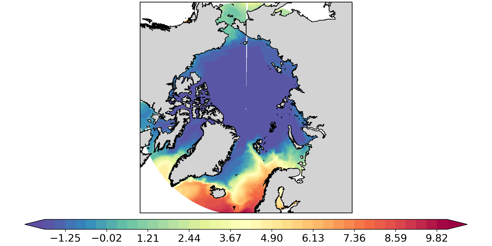
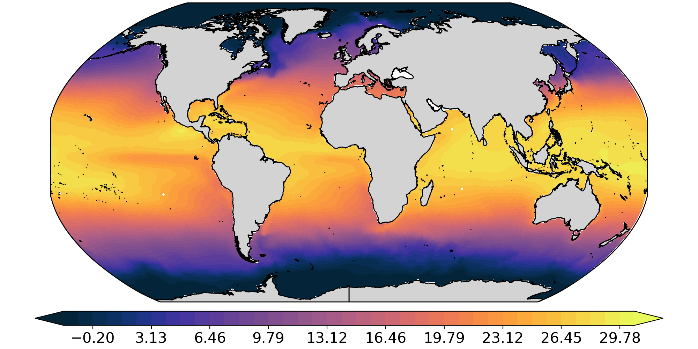
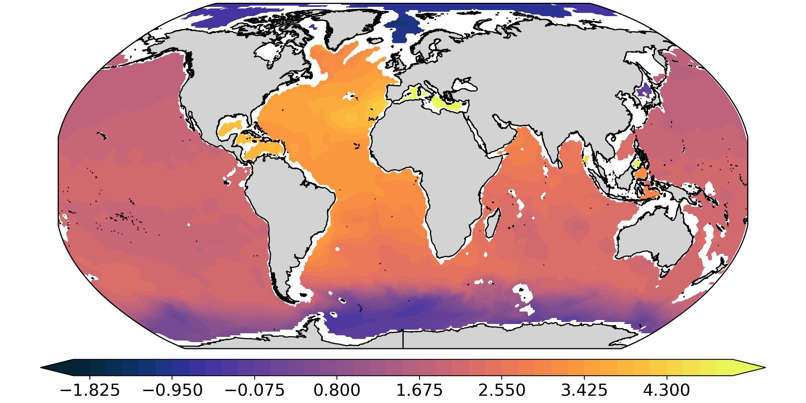

.. _pfplot:

pfplot
======

Plots scalar from FESOM mesh interpolated on regular grid.

There is a lot in common with options from :ref:`pfinterp <pfinterp>`, so we will refer to its documentation instead of repeating.

Basic usage
-----------

As a minimum you should provide path to the mesh, path to the file, path were the ouptut will be stored and variable name::

    pfplot  /path/to/mesh/ /path/to/datafolder/ temp

by default `pfplot` will search for the year 1948 and interpolate first time step from the depth 0 to 1 degree lon/lat regular grid and display it on the screen.

In the following we just going to replace paths by shell variables::

    MESH=/path/to/mesh/
    DATA=/path/to/datafolder/

to make examples more consise. It is also a good practice to setup such variables for yourself, so the commands are shorter.

You can get help with list of all available options by executing::

    pfplot --help

Data selection and interpolation options
----------------------------------------

All interpolation and data selection options are identical to pfinterp. See respective sections on Time selection, Depth selection and Interpolation.

Plotting options
----------------

Projections
___________

Plot ptojection is controlled by the `-m` option. At the moment only five projections are available:

- Mercator (`merc`),
- Plate Carree (`pc`),
- North Polar Stereo (`np`),
- South Polar Stereo (`sp`),
- Robinson (`rob`).

Deafault is Robinson projection.

The map region is defined by the `-b` option, so in order to obtain usuall plot in North Polar Stereo projection, that covers region to the north of 60N

one should adjust the region::

    pfplot $MESH $DATA temp -b -180 180 60 90 -m np

Colormaps
_________

Colormaps are controlled by `--cmap` option. The default colormap is matplotlib's `Spectral_r`. One can provide any colormap name from cmocean package or from the standard matplotlib set::

    pfplot $MESH $DATA temp --cmap thermal

Levels
______

Levels fro the countour plot are controlled by `-l` opetion. One has to provide 3 values: minimum, maximum and the number of levels (they will be used for numpy linspace function). The following command will plot global map of temperature at 2000 m depth with `thetmal` colormap from `cmocean` and 41 level from -2 to 5::

    pfplot $MESH $DATA temp --cmap thermal -d 2000 -l -2 5 41

Plot type
_________

Two plot types are availabale: contourf (`cf`) and pcolormesh (`pcm`). They are controlled through `--ptype` option. In some cases `pcm` might be faster than `cf`, espetially when the field is not smooth and a lot of contour levels should be generated.

